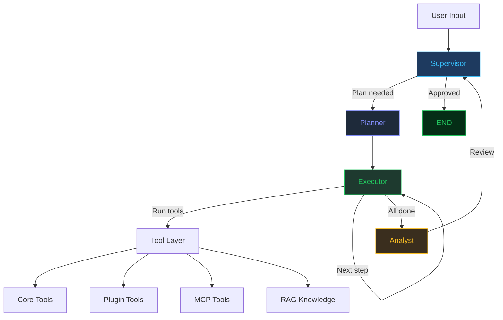
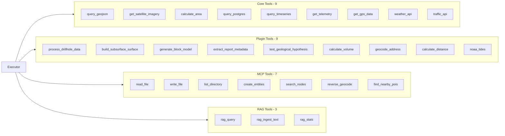

# Geo-Agents SDK

**Multi-agent orchestration for geospatial digital twin platforms.**

A LangGraph-based system where 4 specialized AI agents collaborate to process geological data, analyze results, and provide validated insights — extensible via plugins, skills, and MCP servers.

---

## What This Project Solves

### Problem 1: Manual Software Operation

Geologists spend weeks manually wireframing, building models, and operating complex software. Geo-Agents converts natural language descriptions into automated tool calls.

**Before:** Geologist opens software → manually draws fault lines → builds surfaces → exports model
**After:** Geologist types "Build subsurface model from drillhole data" → agents execute tools → results returned

The Multi-Agent system (Planner → Executor → Analyst) transforms a geologist from a "software operator" back into an "interpreter."

### Problem 2: Hallucination in Geological AI

Most AI systems fail geology in one of two ways:
- **Too creative** — The LLM invents coordinates, grades, or fault lines that don't exist in the data
- **Too shallow** — Just RAG over documents, no actual computation

Geo-Agents solves this with **separation of concerns**:

| Layer | Responsibility | Example |
|-------|---------------|---------|
| **LLM (Reasoning)** | Suggest hypotheses | "Copper grades may improve at depth near F1 fault" |
| **Python (Computation)** | Run deterministic calculations | Process drillhole coordinates, calculate areas, build surfaces |
| **Validation** | Challenge hypotheses | Test against data, confidence scoring |

**The model proposes. The math proves.**

The LLM never generates coordinates. Python computes them. The LLM never invents grades. Tools return real data from databases and APIs.

### Problem 3: Slow Hypothesis Testing

Testing a geological idea currently requires:
1. Submit request to specialist queue
2. Wait days/weeks for analysis
3. Review results
4. Iterate

Geo-Agents reduces this to minutes:
1. Geologist types hypothesis
2. Agents gather data, run analysis, validate results
3. Confidence-scored response returned
4. Iterate immediately

---

## What Still Needs Work

### Gap 1: Traceability and Explainability

**Current state:** The system returns analysis results with sources.

**What's missing:** A full citation engine that links every geological conclusion back to the specific page, paragraph, or data point in the source document.

**Example of what's needed:**
```
"Drill target at lat 40.7128, lon -74.0060"
Evidence:
  - Historical report (1998, page 12): "15m at 2.1% Cu from 180m depth"
  - Geophysics (2020): "IP anomaly extends 800m along strike"
  - Database: "DH-85-012 intersected mineralization at 180m"
```

**Why it matters:** Geologists are naturally skeptical. If the system draws a geological boundary, they will ask "Why here?" A black box will lose their trust immediately.

### Gap 2: Geospatial Guardrails

**Current state:** Tools return deterministic results.

**What's missing:** A validation layer that checks if the LLM's geological interpretation is physically possible before rendering it in 3D.

**Example of what could go wrong:**
- Agent suggests a geological layer that intersects itself
- Agent places a fault in a physically impossible orientation
- Agent extrapolates mineralization beyond the data coverage

**What's needed:** A Python validation layer that:
1. Checks geometric consistency
2. Validates against physical constraints
3. Blocks impossible outputs
4. Returns error to the agent for self-correction

**Why it matters:** An impossible geological model displayed in Cesium will destroy user trust permanently.

### Gap 3: Vanilla RAG Limitations

**Current state:** RAG uses vector similarity search over text chunks.

**What's missing:** The current RAG will fail with historical mining reports because:
- "Gold vein" on page 5 may not be semantically similar to "50m depth" on page 12
- Chunking breaks apart related geological context
- Vector search doesn't understand geological relationships

**What's needed:** Upgrade from vanilla RAG to:
1. **Graph RAG** — Extract entities (rock types, faults, mineralization, depths) and store relationships
2. **Structured extraction** — Convert unstructured reports into structured geological entities
3. **PostGIS integration** — Store extracted coordinates in a spatial database
4. **Entity linking** — Connect "F1 fault" mentioned in 5 different reports

**Example transformation:**
```
Input:  "The F1 fault controls copper mineralization at 150-300m depth"
Output: {
  entity: "F1 fault",
  type: "structural_control",
  commodity: "copper",
  depth_range: [150, 300],
  source: "report_2004.pdf, page 12"
}
```

**Why it matters:** Storing text chunks retrieves paragraphs. Storing geological entities retrieves facts.

---

## Architecture

### Agent Flow



### Tool Layer



---

## Quick Start

```bash
# Install
pip install -e ".[dev]"

# Run tests (59 passing)
pytest tests/ -v

# Start server
python -m uvicorn geo_agents.main:app --port 8084

# Open dashboard
# http://localhost:8084/
```

## Live Examples

### Example 1: Full Agent Pipeline

**Request:**
```bash
curl -X POST http://localhost:8084/api/chat \
  -H "Content-Type: application/json" \
  -d '{"message": "Check weather for drone flight at lat 40.71, lon -74.01"}'
```

**Response:**
```json
{
  "response": "Weather conditions at the drone location (40.71, -74.01) are suitable for flight...",
  "status": "complete",
  "plan": [
    "Get GPS location of drone asset",
    "Check weather at drone coordinates",
    "Assess flight safety based on wind and visibility"
  ],
  "tool_calls": [
    {
      "tool": "get_gps_data",
      "args": {"asset_id": "asset-001"},
      "result": {
        "lat": 40.7128,
        "lon": -74.006,
        "altitude": 10.5,
        "speed": 0.0,
        "heading": 180.0
      }
    },
    {
      "tool": "weather_api",
      "args": {"lat": 40.71, "lon": -74.01},
      "result": {
        "temperature": 18.5,
        "humidity": 72,
        "wind_speed": 12.3,
        "wind_direction": "NW",
        "conditions": "partly_cloudy",
        "visibility_km": 10.0
      }
    }
  ],
  "iterations": 3
}
```

### Example 2: Geological Plugin (Drillhole Processing)

**Request:**
```python
from geo_agents.plugins.base import get_registered_plugins

tools = {name: info.func for name, info in get_registered_plugins().items()}
result = tools["process_drillhole_data"].invoke({
    "collar_lat": 40.7128,
    "collar_lon": -74.0060,
    "collar_elev": 100,
    "depth_from": 150,
    "depth_to": 300,
    "dip": -90,
    "azimuth": 0
})
```

**Response:**
```json
{
  "hole_id": "DH-40712--74006",
  "collar": {"lat": 40.7128, "lon": -74.006, "elev": 100},
  "interval": {"from": 150, "to": 300, "length": 150},
  "midpoint": {"lat": 40.7128, "lon": -74.006, "elev": -125.0},
  "dip": -90,
  "azimuth": 0
}
```

### Example 3: RAG Knowledge Base

**Ingest:**
```bash
curl -X POST http://localhost:8084/api/rag/ingest \
  -H "Content-Type: application/json" \
  -d '{"text": "The copper mineralization occurs at 150-300m depth. Grades: 0.3-1.2% Cu.", "source": "report.txt"}'
```

**Query:**
```bash
curl -X POST http://localhost:8084/api/rag/query \
  -H "Content-Type: application/json" \
  -d '{"query": "What are the copper grades?", "n_results": 3}'
```

**Response:**
```json
{
  "answer": "[1] (source: report.txt, similarity: 0.60)\nThe copper mineralization occurs at 150-300m depth...",
  "sources": [
    {"source": "report.txt", "similarity": 0.601, "text_preview": "The copper mineralization..."},
    {"source": "drill_report_2024.txt", "similarity": 0.473, "text_preview": "Historical drilling..."}
  ],
  "num_results": 3
}
```

### Example 4: Plan Generation

**Request:**
```bash
curl -X POST http://localhost:8084/api/demo/plan
```

**Response:**
```json
{
  "demo": "plan_generation",
  "objective": "Survey the copper deposit at ABC mine, check weather, and analyze drillhole data",
  "plan": [
    "Step 1: Use get_gps_data to obtain GPS coordinates of drillholes",
    "Step 2: Use weather_api to check weather conditions at the mine",
    "Step 3: Use query_postgres to retrieve historical drillhole data",
    "Step 4: Use calculate_area to compute the survey area"
  ],
  "steps_count": 4
}
```

## SDK Usage

```python
from geo_agents import GeoAgentsSDK

sdk = GeoAgentsSDK()

# Full agent pipeline
result = await sdk.run("Check weather for drone flight")
print(result.response)
print(result.plan)
print(result.tool_calls)

# Plan only
plan = await sdk.plan("Survey the mining site")

# Analyze data
analysis = await sdk.analyze("Temperature readings")

# List tools/skills
tools = sdk.list_tools()      # 28 tools
skills = sdk.list_skills()    # 6 skills
```

## API Endpoints

| Endpoint | Description |
|----------|-------------|
| POST /api/chat | Full agent pipeline |
| POST /api/plan | Generate plan only |
| POST /api/analyze | Analyze data |
| GET /api/tools | List all tools |
| GET /api/skills | List all skills |
| GET /api/plugins | List plugins |
| GET /api/mcp | List MCP servers |
| GET /api/rag/stats | RAG knowledge base |
| POST /api/rag/ingest | Add documents |
| POST /api/rag/query | Search documents |
| GET /health | Health check |
| GET /metrics | Request metrics |
| GET / | Dashboard |

## Dashboard

The dashboard is available at `http://localhost:8084/` and includes:

| Tab | Description |
|-----|-------------|
| **Overview** | System status, tools, skills, agents |
| **Architecture** | Visual flow diagram of the agent pipeline |
| **Extensions** | All plugins, skills, MCP servers, RAG |
| **Live Demos** | 13 clickable demos with real API responses |
| **Agent Chat** | Full pipeline with step-by-step visualization |
| **API** | All endpoints + embedded Swagger UI |

### Extension Loading Flow

```mermaid
graph TD
    A[Server Startup] --> B[Scan plugins/ directory]
    A --> C[Scan skills/ directory]
    A --> D[Load mcp_servers.json]
    A --> E[Initialize RAG]

    B --> F[@register_tool decorated functions]
    C --> G[YAML skill definitions]
    D --> H[MCP server connections]
    E --> I[ChromaDB vector store]

    F --> J[Merged Tool Registry]
    G --> J
    H --> J
    I --> J

    J --> K[28 tools available]

    style A fill:#1e3a5f,stroke:#38bdf8,color:#38bdf8
    style J fill:#1e3a2f,stroke:#22c55e,color:#22c55e
    style K fill:#052e16,stroke:#22c55e,color:#22c55e
```

---

## Extension System

### Add a Plugin (drop .py in plugins/)

```python
from geo_agents.plugins.base import register_tool

@register_tool(name="my_tool", description="Does X", category="Custom")
def my_tool(param: str) -> dict:
    return {"result": param}
```

### Add a Skill (drop .yaml in skills/)

```yaml
name: my_skill
description: Does something useful
tools: [weather_api, get_gps_data]
system_prompt: |
  You are a specialist in...
steps:
  - Step 1
  - Step 2
```

### Add an MCP Server (edit mcp_servers.json)

```json
{
  "name": "my-server",
  "transport": "stdio",
  "command": "npx",
  "args": ["-y", "@my/mcp-server"],
  "tools": [{"name": "tool1", "description": "..."}]
}
```

### Add RAG (ingest documents)

```python
from geo_agents.rag import RAGEngine

rag = RAGEngine()
rag.ingest_text("Copper grades range from 0.3% to 1.2%...", source="report.txt")
rag.ingest_file("drill_report.pdf")

result = rag.query("What are the copper grades?")
```

## Current Extensions

| Type | Count | Examples |
|------|-------|---------|
| Core Tools | 9 | GIS, Database, Sensors, External |
| Plugins | 9 | Geology (drillhole, block model, hypothesis) |
| Skills | 6 | Weather planning, fleet monitoring, subsurface modeling |
| MCP Servers | 3 | Filesystem, memory, geo-mcp |
| RAG Tools | 3 | Query, ingest, stats |
| **Total** | **28 tools** | |

## Tech Stack

- Python 3.11+
- LangGraph (agent orchestration)
- LangChain (tool abstraction)
- FastAPI (API server)
- ChromaDB (vector storage)
- sentence-transformers (embeddings)

## Project Structure

```
geo-agents/
├── src/geo_agents/
│   ├── __init__.py          # SDK exports
│   ├── client.py            # GeoAgentsSDK
│   ├── config.py            # Multi-provider config
│   ├── state.py             # AgentState
│   ├── graph.py             # LangGraph construction
│   ├── exceptions.py        # Custom errors
│   ├── main.py              # FastAPI server
│   ├── agents/              # 4 agent nodes
│   ├── tools/               # Core + registry
│   ├── plugins/             # Plugin system
│   ├── skills/              # Skill system
│   ├── mcp/                 # MCP integration
│   ├── rag/                 # RAG engine
│   └── api/                 # Routes + WebSocket
├── plugins/                 # User plugins
├── skills/                  # Skill definitions
├── mcp_servers.json         # MCP config
├── dashboard.html           # Web UI
├── tests/                   # 59 tests
└── pyproject.toml
```

---

*"The model proposes. The math proves."*
